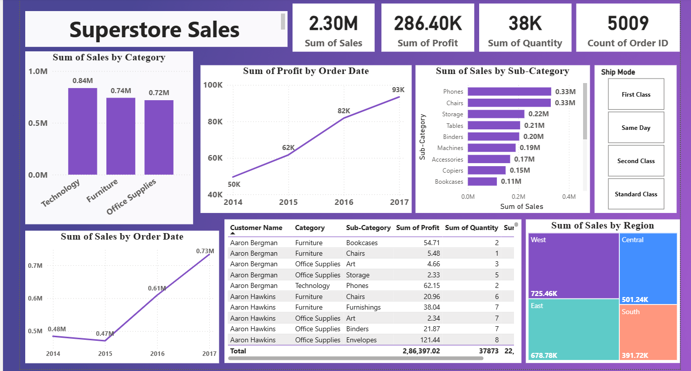

<h1 align="center">📊 Superstore Sales Dashboard using Power BI</h1>

<h2>📌 Project Overview</h2>

The <strong>Superstore Sales Dashboard</strong> is an interactive Business Intelligence solution developed using
<strong>Microsoft Power BI</strong>. The dashboard provides a comprehensive analysis of sales performance,
profitability, product categories, customer orders, and regional trends. It transforms raw sales data into meaningful
visual insights that support data-driven business decisions.

This project demonstrates the use of <strong>Data Visualization</strong> and
<strong>Storytelling</strong> techniques to identify business opportunities,
monitor Key Performance Indicators (KPIs), and evaluate overall business performance.

<h2>🎯 Problem Statement</h2>

A retail superstore operates across multiple regions and offers products in different categories.
The management requires an interactive dashboard to monitor overall business performance and answer
important business questions such as:

<ul>
    <li>Which product category generates the highest sales?</li>
    <li>Which regions contribute the most revenue?</li>
    <li>How have sales and profit changed over the years?</li>
    <li>Which sub-categories perform best?</li>
    <li>How does shipping mode impact order distribution?</li>
    <li>What are the key performance indicators (KPIs) of the business?</li>
</ul>

The objective is to analyze historical sales data using
<strong>Power BI</strong> and convert it into actionable business insights that
support strategic decision-making and improve profitability.

<h2>📂 Dataset</h2>

<strong>Dataset Name:</strong> Superstore Sales Dataset

The dataset contains sales transactions from <strong>2014–2017</strong> with the following fields:

<ul>
    <li>Order ID</li>
    <li>Order Date</li>
    <li>Customer Name</li>
    <li>Region</li>
    <li>Category</li>
    <li>Sub-Category</li>
    <li>Sales</li>
    <li>Profit</li>
    <li>Quantity</li>
    <li>Ship Mode</li>
</ul>

<h2>🛠 Tools &amp; Technologies</h2>

<ul>
    <li>Microsoft Power BI Desktop</li>
    <li>Microsoft Excel / CSV</li>
    <li>Power Query</li>
    <li>DAX (Data Analysis Expressions)</li>
</ul>

<h2>📋 Steps Followed</h2>

<ol>

<li>
Loaded the <strong>Superstore Sales CSV</strong> dataset into Power BI Desktop.
</li>

<li>
Opened <strong>Power Query Editor</strong> to inspect and prepare the data.
</li>

<li>
Verified data quality using:
<ul>
    <li>Column Distribution</li>
    <li>Column Quality</li>
    <li>Column Profile</li>
</ul>
and enabled profiling for the <strong>Entire Dataset</strong>.
</li>

<li>
Validated data types and confirmed that there were no missing or duplicate records affecting the analysis.
</li>

<li>
Performed data cleaning and transformation using Power Query.
</li>

<li>
Applied a professional Power BI theme and designed the dashboard layout.
</li>

<li>
Created KPI Cards displaying:
<ul>
    <li>Total Sales</li>
    <li>Total Profit</li>
    <li>Total Quantity Sold</li>
    <li>Total Orders</li>
</ul>
</li>

<li>
Built interactive visualizations including:
<ul>
    <li>Sales by Category</li>
    <li>Profit Trend by Year</li>
    <li>Sales Trend by Year</li>
    <li>Sales by Sub-Category</li>
    <li>Sales by Region</li>
    <li>Customer Details Table</li>
    <li>Ship Mode Slicer</li>
</ul>
</li>

<li>
Added interactive slicers to filter dashboard data based on Ship Mode.
</li>

<li>
Formatted all visuals with appropriate titles, colors, labels, and layout to improve readability and storytelling.
</li>

</ol>

<h2>📊 Dashboard Visualizations</h2>

<h3>🔹 KPI Cards</h3>

Displays the overall business performance.

<table>
<tr>
<th>KPI</th>
<th>Value</th>
</tr>

<tr>
<td>Total Sales</td>
<td><strong>2.30M</strong></td>
</tr>

<tr>
<td>Total Profit</td>
<td><strong>286.40K</strong></td>
</tr>

<tr>
<td>Total Quantity Sold</td>
<td><strong>38K</strong></td>
</tr>

<tr>
<td>Total Orders</td>
<td><strong>5009</strong></td>
</tr>

</table>

 

<h3>🔹 Sales by Category</h3>

A column chart comparing sales across the following categories:

<ul>
    <li>Technology</li>
    <li>Furniture</li>
    <li>Office Supplies</li>
</ul>

<h3>🔹 Profit Trend by Year</h3>

A line chart displaying annual profit growth from <strong>2014 to 2017</strong>.

<h3>🔹 Sales Trend by Year</h3>

Visualizes yearly sales performance and highlights business growth trends.

<h3>🔹 Sales by Sub-Category</h3>

The dashboard analyzes sales across major product sub-categories:

<ul>
    <li>Phones</li>
    <li>Chairs</li>
    <li>Storage</li>
    <li>Tables</li>
    <li>Binders</li>
    <li>Machines</li>
    <li>Accessories</li>
    <li>Copiers</li>
    <li>Bookcases</li>
</ul>

<h3>🔹 Sales by Region</h3>

Treemap visualization comparing sales across:

<ul>
    <li>West</li>
    <li>East</li>
    <li>Central</li>
    <li>South</li>
</ul>

<h3>🔹 Ship Mode Filter</h3>

The dashboard includes an interactive slicer for:

<ul>
    <li>First Class</li>
    <li>Same Day</li>
    <li>Second Class</li>
    <li>Standard Class</li>
</ul>

<h3>🔹 Customer Details Table</h3>

The customer table displays:

<ul>
    <li>Customer Name</li>
    <li>Category</li>
    <li>Sub-Category</li>
    <li>Profit</li>
    <li>Quantity</li>
</ul>

<h2>📈 Dashboard Snapshot</h2>

    

<h2>📊 Business Insights</h2>

<h3>✅ Overall Business Performance</h3>

<ul>
    <li><strong>Total Sales:</strong> 2.30 Million</li>
    <li><strong>Total Profit:</strong> 286.40 Thousand</li>
    <li><strong>Total Quantity Sold:</strong> 38 Thousand Units</li>
    <li><strong>Total Orders Processed:</strong> 5009</li>
</ul>

<h3>✅ Key Findings</h3>

<ul>
    <li>Technology generated the highest sales among all product categories.</li>
    <li>Profit increased steadily from 2014 to 2017.</li>
    <li>Phones and Chairs are the top-selling sub-categories.</li>
    <li>The West region contributes the highest overall sales.</li>
    <li>Interactive filters allow users to analyze data by Ship Mode.</li>
</ul>

<h2>🚀 Project Outcome</h2>

This Power BI dashboard successfully transforms raw sales data into meaningful business insights through
interactive visualizations and storytelling techniques. It enables stakeholders to monitor KPIs,
identify sales trends, evaluate regional performance, and make informed business decisions.

<h2>📚 Skills Demonstrated</h2>

<ul>
    <li>Power BI Dashboard Development</li>
    <li>Data Cleaning using Power Query</li>
    <li>Data Modeling</li>
    <li>DAX Calculations</li>
    <li>Business Intelligence Reporting</li>
    <li>Interactive Dashboard Design</li>
    <li>Data Visualization</li>
    <li>Storytelling with Data</li>
</ul>

<h2 align="center">⭐ Thank You for Visiting! ⭐</h2>

If you found this project helpful, please consider giving this repository a <strong>⭐ Star</strong>.

